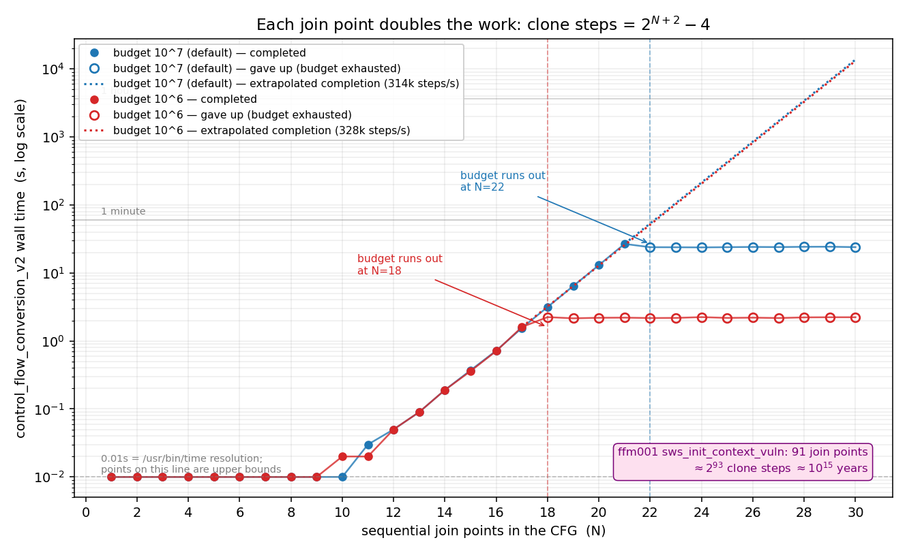

# LLVM IR -> Spoq IR fixtures

Inputs for the two unit tests that drive the front end directly from a `.ll`
file, with no project, `main.v` or solver:

| test | entry point | what it covers |
|---|---|---|
| `CfgConversionTest` | `control_flow_conversion_v2` | CFG normalisation |
| `IrTranslationTest` | `llvm_ir_to_spoq_ir` + `spoq_inst_to_spec` | translation to Spoq IR and on to SpecNodes, CFG pass **skipped** |

`IrTranslationTest` covers two stages, and they fail differently:

1. **`llvm_ir_to_spoq_ir`** -- CFG walk to a flat `spoq_inst_vec_t`. Does *not*
   interpret instructions; `dfs_llvm_ir_to_spoq_inst_vec` packs every non-branch
   instruction as an opaque `SpoqLLVMInst`, so this stage accepts anything the
   walk reaches.
2. **`spoq_inst_to_spec`** -- that vector to a `SpecNode`. This is where
   instructions are interpreted, so an unsupported opcode fails *here*. Needs a
   `Project` and `SpoqIRContext`; `make_minimal_project()` builds the smallest
   one that works (one `Layer` with an `abs_data` type, plus `cmds.StackMap`
   entries for any allocas -- that arm asserts on a missing entry).

Stage-2 assertions check the emitted SpecNode text, so a silently wrong
translation fails rather than passing on "something was produced":

    let sum := (a + (b)) in
    let prod := (sum * (3)) in
    ...
    (Some (masked, st))

Both run each case in a forked child with a deadline, so a hang or an `assert()`
is reported rather than taking the suite down, and both double as
`llvm-reduce` oracles (`--convert` / `--translate`).

The two stages are coupled by a precondition worth stating once: the translator
asserts that PHI nodes appear only in loop headers/postheaders
(`SpoqIRTranslator.cpp:132`). Getting rid of join phis is what
`control_flow_clone_and_split` does, by cloning the join point until nothing
merges there -- which is also why that pass blows up exponentially. So a fixture
with a join phi is in scope for `CfgConversionTest` but not for
`IrTranslationTest`.

## Translation fixtures

In scope for the CFG-pass bypass (no natural loops, no join phis):
`translate_straightline.ll`, `translate_ifelse.ll` (arms return),
`translate_memory.ll` (alloca/store/load/GEP/global).

Out of scope, kept to pin the boundaries: `translate_ifelse_joinphi.ll` (hits
the PHI assert) and `nested_loop.ll` (needs the preheader/postheader rewrite).
`nested_loop.ll` doubles as the `CfgConversionTest` sanity case, where it
converts in ~100ms.

`translate_select.ll` and `translate_select_chain.ll` cover `select`, which
`spoq_inst_to_spec` now translates directly to an `If`:

    let cmp := (x =? (50)) in
    let sel := (
        if cmp
        then 100
        else 200) in
    (Some (sel, st))

`control_flow_eliminate_select` (Phase 1), which rewrites a select into a
diamond with a join phi, is not called.

## Join points

`control_flow_clone_and_split` does not run. A join phi is resolved during
translation against the edge the walk arrived on, and when both arms of a branch
reconverge the arms stop at the join and the code after it is emitted once:

    %r = phi i32 [ %t, %then ], [ %e, %else ]

    let cmp := (a >? (b)) in
    when r, st == (
        if cmp
        then (let t := (a + (1)) in (Some (t, st)))
        else (let e := (b - (1)) in (Some (e, st))));
    (Some (r, st))

See `SpoqPhiInst` and `SpoqJoinInst` (`include/SpoqIR.h`), `reconvergence_point`
and the `SpoqIfInst` arm of `spoq_inst_to_spec`.

A chain of N diamonds therefore costs O(N): 10 joins produce a 1.0KB spec, 20
produce 2.1KB, 40 produce 4.3KB, 200 produce 22KB.

### What `SPOQ_CFG_CLONE_JOINS=1` restores

Cloning removes a join point -- any block with two or more predecessors -- by
duplicating it and everything downstream of it, once per incoming edge, so that
no phi has more than one incoming value. Join points in sequence compound, and
the cost is not merely "exponential" but exactly

    clone steps(N) = 2^(N+2) - 4        for N sequential join points

measured by bisecting `SPOQ_CFG_REPEAT_LIMIT` for N = 1..18: 4, 12, 28, 60, 124,
252, 508, 1020, ..., 1048572, a ratio of 2.000 from N = 12 up. It does not hang;
it runs until the `repeats` budget is gone and throws "block size too large".
The default budget of 10^7 runs out from N = 22 on, and N = 21 takes ~27s and
4.2GB.

Nothing in the pipeline needs the switch; it exists so that cost stays
measurable, and `CfgConversion.JoinScaling.CloningCostIsTwoToTheNPlusTwo`
asserts the closed form through it.

**What counts is join points, not phi nodes.** `require_split`
(`SpoqIRModule.h:275`) ends in `pred_size(bb) >= 2` and never looks at phis, so
a diamond costs the same whether or not a value is merged at the bottom of it.
`CfgConversion.PhiNodesDoNotChangeTheCost` pins that.

| | cloning on | default |
|---|---|---|
| 21 join points | 26.7s, 4.2GB | 0.01s |
| 22 join points | over budget, 23.9s to give up | 0.01s |
| 30 join points | ~3.8 hours to complete | 0.01s |
| `ffm001_sws_init_context.ll` | throws after ~255s, 17GB | **converts, 0.02s** |
| `tiffillstrip.ll` | returns false, phi not eliminated | **converts** |
| `tiffillstrip_dup_phi_pred.ll` | returns false, phi not eliminated | **converts** |

`ffm001_single_block_valuename.ll` is a third case: one basic block, 51 `||`
short-circuit selects, no join points of its own. Selects translate directly to
an `If`, so it converts in ~0.1s.

### Which branches reconverge

`reconvergence_point` is structural, and recognises two shapes: the diamond
(both arms a single block branching to a common join) and the triangle
(`if (c) { arm }`, where one successor is the join). Anything else -- an arm
with control flow of its own, or a join with three or more predecessors -- is
declined, and the walk runs each arm to its own return, duplicating whatever
follows. `translate_multi_phi_three_preds.ll` is an example of the fallback.

That fallback is still exponential in the number of declined branches, which is
why `sws_init_context_vuln` converts in 0.02s and then does not finish
translating: 35s to exhaust an 8GB cap. Widening the detector -- multi-block
arms via post-dominators, and joins with more than two predecessors -- is what
that case needs.

### Measuring it yourself

    ./gen_join_chain.py 22 > chain22.ll        # N diamonds, no phis, no selects
    ./gen_join_chain.py 22 phi > chain22.ll    # same with phis, same cost

    ./join_scaling_sweep.sh 10000000 > join_scaling_10e6.csv   # production budget
    ./join_scaling_sweep.sh 1000000  > join_scaling_1e6.csv    # ~10x cheaper
    ./plot_join_scaling.py join_scaling.png \
        "budget 10^7 (default)=join_scaling_10e6.csv" \
        "budget 10^6=join_scaling_1e6.csv"

The graph is of the cloning path, i.e. what `SPOQ_CFG_CLONE_JOINS=1` restores.
The flat tails are the budget cap, not the input: past the cap the run reports
the time to *give up*, and the dotted lines are what completing would have cost
at the measured step rate (~314k steps/s).

`SPOQ_CFG_REPEAT_LIMIT` lowers the budget so an oracle gets a verdict in seconds
instead of ~256s; unset keeps the 10^7 default. It is a sharp instrument and
easy to misuse: `sws_setColorspaceDetails` (48 blocks, same ffmpeg module)
genuinely converted and needed ~5x10^5 steps, so a budget below that would call
a healthy function broken.

## tiffillstrip.ll

`TIFFFillStrip` and its callees, extracted from
`patchverification/examples/libtiff/tif003/build/tif_read.ll` with

    llvm-extract --func=TIFFFillStrip --recursive

909 lines, 7 functions, runs in ~2s where the full module is very slow. It
converts; kept as the real-world case for a five-way join, which under
`SPOQ_CFG_CLONE_JOINS=1` makes `control_flow_conversion_v2` return false (it
does not throw, so there is no `error:` line -- only
`[CFG] TIFFFillStrip not converted.`):

    phi:   %cond = phi i1 [ false, %if.then113 ], [ false, %if.then76 ],
                          [ false, %if.then107 ], [ true, %if.end131 ],
                          [ false, %if.then101 ]
    some PHI are not eliminated but required so

Cloning leaves that five-way join with several predecessors, so its phi cannot
be reduced to a single incoming value. Nothing requires it to be: the walk
resolves it against whichever of the five edges it arrived on.

`TIFFFillStrip` also contains two unreachable blocks -- `land.lhs.true` and
`if.then9`, both marked `; No predecessors!` -- and these are present in the
*original* module, not introduced by `llvm-extract`. Running
`opt -passes=unreachableblockelim` on the extracted module makes the failure go
away, so they are implicated, but see below: they are not on their own
sufficient.

## tiffillstrip_dup_phi_pred.ll

14 lines, produced by `llvm-reduce` from the above. It provoked the same error
message, but **by a different mechanism**, so it is kept separate rather than
treated as a minimisation of the first. It also converts now:

    if.then21:                        ; No predecessors!
      br i1 false, label %cleanup138, label %cleanup138
    cleanup138:                       ; preds = %if.then21, %if.then21, %entry
      %retval.3 = phi i32 [ 0, %entry ], [ 0, %if.then21 ], [ 0, %if.then21 ]

The conditional branch has both targets equal, so the phi has two incoming
entries from the *same* predecessor. The cloner split per predecessor edge and
could not collapse a duplicated one. Resolving per edge is indifferent to it:
LLVM's verifier rejects a phi that gives one predecessor two *different* values,
so taking the first entry for that predecessor is unambiguous.

## reproduce.sh

    ./reproduce.sh tiffillstrip.ll     # exit 0 = the failure is present

Builds a scratch project around the given module (it reuses a fixed `main.v`, so
it only varies the bitcode) and greps spoq's stderr. Also usable as an
`llvm-reduce --test=` interestingness script. The failure it greps for does not
occur by default, so it exits 1 unless `SPOQ_CFG_CLONE_JOINS=1` is set.

## Relationship to `SpoqTest`

These cases are deliberately *not* `SpoqTest` cases. That harness runs spoq
end to end and compares `<test>.expected.json`, which requires a clean exit and
a result JSON; several fixtures here abort or run for minutes. Driving the two
front-end entry points directly keeps them fast and attributes a failure to the
stage that caused it.

All of these pass; `CfgConversion.Ffm001SwsInitContextConverts` converts in
~0.1s.
